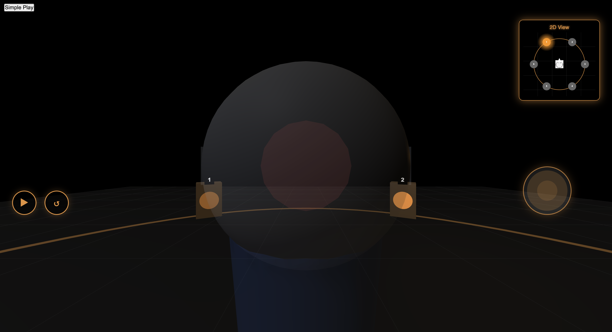

# 3D Visualization for the cool Spatial Audio thing

(Updated June 8, 2025)

This is a 3D visualization in the works that is meant to go along with the main interface for the spatial audio playground (the Boulez project)!

### Command to run this

`python3 -m http.server 8000`

> **Note: there are two specific bugs that occur, but they both have workarounds:**
>
> - When clicking on the "Audio Engineer" mode, the 3D view "disappears" and the 2D view appears to be stretched and pixel-blurred. **To fix this: click the `Hide 3D View` button, and then click it again. This will toggle the 3D view, and the 3D view should then come into view, and the 2D view should be clear and un-stretched.**
> - When going from the Audio Engineer mode to the Audience mode, the 2D and 3D views are in weird places once again. **To fix this: simply click on the `Audience` button in the mode selector at the top-left corner again. This will solve the issue.**

> **Outstanding Tasks:**
>
> - Add text to each of the 5 remaining slides in the audience view
> - Fix the two bugs stated above (if possible; it appears to be quite difficult to do so!)
> - Implement Strophe V
> - Need Professor Ruthmann to check on the behavior of transition1-2 and transition3-4 to make sure that they follow what is requested on the score

## Command to run this

`python3 -m http.server 8000`

## Below are screenshots from various different points during the coding process

### April 1

### End of April

### End of May

##### Audio Engineer

##### Audience

##### Performer

### June 8

##### Audio Engineer

##### Audience * Performer (combined into one UI)

## TODOs (Outdated):

- [ ] Add 3 modes: Audio engineer (default); Audience member with movable position; and Performer mode.
- [ ] Add Transitions 1-2 and 3-4, plus Strophe V audio scenes and timings (and navigation toggle)
    - [ ] Solutlion for accelerating circular panning for Transition 3-4.
    - [ ] Solution for cross fading dry/wet piano resonator effect for Strophe V.
- [ ] Add solution for “pop-up” trivia about the piece/composer in each section. Also housed in a browsable/searchable About the Piece section.
- [ ] Add solution for scrolling melodic contour display with mix cues with toggle to scrolling notation view.
- [ ] Add toggle for “listen” vs. “live mix” modes
- [ ] Study and reconsider thumb pad speaker navigation. What might be easier/more intuitive for the novice user.
---

# INCOMPLETE DRAFT; NOT DONE YET!

## **Journey of creating the 3D spatial audio environment.**

**This report details the process, improvements, and obstacles encountered during the development of a 3D spatial audio environment.**

### **Plan/Improvements**

**The initial phase of this project featured a simple 2D interface. However, this lacked the immersive realism required to truly experience a musical piece as if in a live setting. To address this, I undertook a significant revamp, transitioning the entire environment to a 3D simulation using THREE.js. This allowed for the realistic positioning of six speakers within a three-dimensional space.**

**A key enhancement in the new 3D environment was the ability for users to move freely within the ring formed by these speakers, offering a dynamic listening experience.**

**To further enhance realism, particularly for those simulating the role of an audio engineer, I implemented ergonomic keybindings. These controls were designed to mirror the tactile experience of managing speakers during a live performance.**

**The environment was designed with three distinct operational modes: Audio Engineer, Audience, and Performer.**

* ****Audio Engineer Mode:****** In this mode, the engineer gains direct control over the individual speakers using keybindings (1, 2, 3, 4, 5, 6 for selection, and U, I, K, M, N, H for adjustments). This feature is crucial for simulating the authentic experience of an audio engineer and provides a unique opportunity for newcomers to understand this role.**
* ****Audience Mode:****** This mode allows users to navigate the space within the speaker circle. By changing their position, they can experience different acoustic perspectives. Additionally, a picker tool enables them to instantly switch between the auditory viewpoints of different speakers.**
* ***TODO: Add Performer details, exigence for creating it, and why it is now being removed later (add after lunch)***

**Several other important features were incorporated to enrich the user experience:**

* ****Sound Indicators:****** Visual cues were added to indicate when sounds are activated from the speakers. These indicators are particularly helpful for the audio engineer, allowing them to anticipate and prepare for necessary adjustments.**
* ****Info Slides:****** To create an experience akin to visiting a museum or gallery, "Info Slides" were integrated. These slides allow users to learn about the musical piece and the audio setup in an interactive manner.**
* ****Dynamic Sound Realism:****** A critical aspect of the 3D environment is its sophisticated sound rendering. The direction and volume (magnitude) of sound emanating from the speakers dynamically change based on the audience member's precise location and the direction they are looking. This feature is paramount in achieving a spatial environment that is as realistic as possible.**

### **Obstacles:**

**The development process, while rewarding, was not without its challenges.**

* ****Framework Selection:****** One of the initial hurdles was identifying the most suitable framework for simulating the 3D environment, which ultimately led to the adoption of THREE.js.**
* ****Leveraging AI Tools:****** Effectively using AI tools to accelerate development proved to be a complex task. This involved:**
  * ****Strategic AI Selection:****** Learning to alternate between different AI models based on their specializations. For instance, Claude Sonnet 3.7 was found to be adept at UI design, GPT 4.1 excelled with underlying audio logic, and Gemini 2.5 Pro was particularly useful for finding specific code snippets.**
  * ****Managing AI Conversations:****** AI conversations could become "stale," often lacking sufficient context to support a project of this magnitude over extended periods.**
  * ****Prompt Engineering:****** Discovering that specific and carefully crafted prompting is essential to elicit the necessary information or code from AI tools.**
  * ****Limitations of Agent Mode:****** For a project with this level of complexity, AI "agent mode" was found to be not particularly useful. A more hands-on, collaborative approach involving direct editing and iterative refinement with AI assistance was necessary.**
  * ****AI's Strengths and Weaknesses:****** It became clear that AI tools were most helpful for understanding specific coding frameworks or for debugging existing code. Their reliability in generating entirely new, complex code was, in my experience, not yet fully dependable.**
* ****Code Modularity and Sustainability:****** A significant ongoing challenge was modularizing the codebase. Developing a strategy to ensure the code remains resusable across different movements and sustainable for future development and maintenance required considerable effort.**
* ****Feature Stability and Regression:****** Perhaps one of the most persistent and frustrating obstacles was ensuring that existing features remained functional after introducing new ones or committing changes.**
  * **It was often the case that adding a new feature or ability would inadvertently break an existing one, or, in some perplexing instances, cause features to disappear entirely without an immediately obvious reason.**
  * ****A particularly difficult and illustrative example of this was maintaining feature integrity after expanding the project beyond the initial "Sigle Initial" movement. Specifically, the picker selector (used in audience mode for choosing between different speaker perspectives) vanished. Concurrently, in the audio engineer mode, the intended swap between 2D and 3D views (where the 2D view is supposed to become primary to aid the engineer) failed to occur.****** This highlighted the critical challenge of regression testing and ensuring system stability throughout the development lifecycle.**

---

Below is (an outdated) documentation generated by Visual Studio's Copilot
-------------------------------------------------------------------------

# 3D Visualization for Spatial Audio Environment

## Overview

This project creates an immersive 3D visualization system for spatial audio, allowing users to experience and interact with audio sources positioned in a virtual 3D environment. The system renders six speakers in a hexagonal arrangement around a central listener, with real-time audio routing between speakers based on predefined patterns.

## Key Components

### 3D Visualization (`3DVisualization.js`)

- Creates an immersive 3D scene with speakers, environment, and listener avatar
- Provides joystick and drag controls for rotation within the audio space
- Visualizes sound waves emanating from active speakers
- Renders a 2D top-down view with speaker activity indicators

### Audio Processing (`script.js`)

- Implements spatial audio using the Web Audio API
- Routes audio between six virtual speakers based on predefined patterns
- Synchronizes audio playback with visual elements
- Supports play/pause and reset functionality

### Audio Visualization (`AudioVisualizer.js`)

- Shows speaker activity and music phrases
- Provides timeline visualization with phrase markers
- Includes waveform visualization of the audio

## User Interaction

- Rotate the listener using joystick or drag controls
- Play/pause audio with controls
- Reset position and audio with reset button
- View active speakers in both 3D and 2D perspectives

## Technical Details

- Built with Three.js for 3D rendering
- Uses Web Audio API for spatial audio processing
- Implements HRTF panning for realistic spatial audio perception
- Responsive design with adaptations for mobile devices

## Browser Compatibility

- Optimized for Chrome and other modern browsers supporting Web Audio API
- Requires browser support for ES6 modules and three.js
